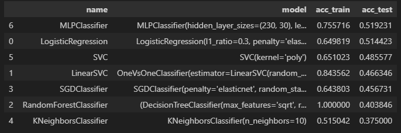

# Проект "Классификация эмоций в текстовых расшифровках голосовых сообщений"
Разработан в рамках Хакатон DSMED x MFTIBIO. 

**Задание №1.**
Задача «Классификация эмоций в текстовых расшифровках голосовых сообщений»
Цель
Определить настроение говорящего, анализируя текстовую расшифровку его голосового сообщения.

**ИТОГИ** Итогом проекта стала программа угадывающая эмоцию по текстовому сообщению. Использующая в работе полносвязную нейронную сеть с двумя скрытыми слоями. Качество угадывания, верно в 52% при 8 возможных вариантах ответа. Что довольно не плохо. 

## Описание проекта
* В рамках проекта произведено исследование данных, очистка, токенизация, а так жекодирование целевого признака.
* После чего была подобрана модель, показавшая лучшие результаты на тестовой выборке. В таблице ниже представлины названия моделей и результаты их работы.

* Модель показавшаю наилучшие результаты сохранена в файл, для последующего использования

## Файлы проекта
Проект состоит из следущих файлов:
* **Classifier.ipynb** - Ноутбук исследование
* **target.pkl** - словарь эмоций
* **Classifier.ipynb** - модель машинного обучения
* **Guess_the_emotion.py** - Программа использующая в работе модель. Принимает текст с калвиатуры, и выдает эмоцию на экран.
* **data** - каталог, содержит исходные данные для обучения модели

